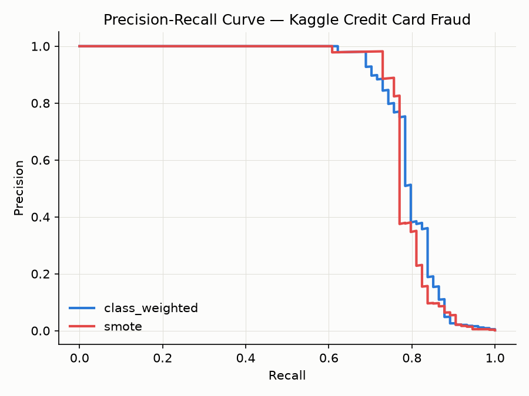
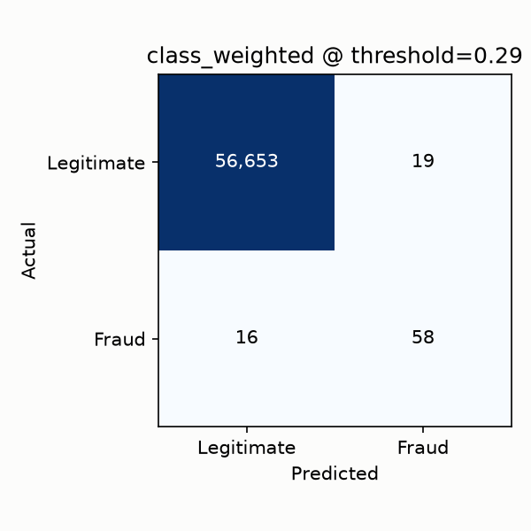
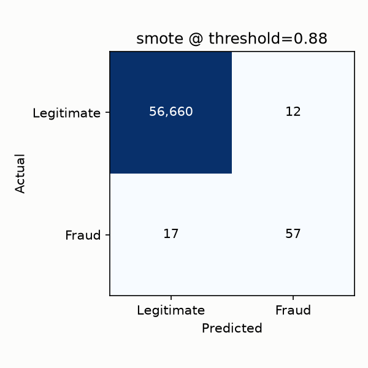

# Credit Card Fraud Detection System

[](https://github.com/liamhavers/fraud-detection-system/actions/workflows/ci.yml)

End-to-end fraud detection: raw transaction data → an imbalance-aware trained model → a served prediction API → basic production monitoring — plus a second, richer dataset for feature-engineering depth and a statistically rigorous offline A/B test.

Built as a portfolio project demonstrating end-to-end, production-minded ML engineering for tech/finance Data Scientist roles.

**Live demo**: [fraud-detection-api-u874.onrender.com/docs](https://fraud-detection-api-u874.onrender.com/docs) — interactive Swagger UI, try `/predict` directly. Hosted on Render's free tier, so it spins down after 15 minutes idle; the first request after a while may take 30–60 seconds to cold-start (see [Deploy to Render](#deploy-to-render-optional) for how this is set up).

**Follow-on project**: [fraudDetection_databricks](https://github.com/liamhavers/fraudDetection_databricks) rebuilds the IEEE-CIS side of this work as a Spark pipeline on Databricks, with Delta Lake tables, past-only velocity features, MLflow model tracking with champion and challenger aliases, batch scoring and weekly PSI drift, run as one scheduled Databricks Job.

## Problem Statement

> The real job isn't maximising accuracy — it's finding the operating point that minimises the *combined expected cost* of missed fraud and false alarms.

Card issuers lose money two ways: missed fraud (direct loss, chargebacks, reputational damage) and false alarms (blocked legitimate transactions, customer churn, manual review cost). With fraud typically well under 1% of transactions, a model that predicts "not fraud" every time is 99%+ "accurate" and useless — accuracy as a headline metric would be actively misleading here. That cost trade-off, made explicit, is the core deliverable of this project.

## Phase 0 Decisions (locked)

These decisions were made deliberately up front, to keep the project focused rather than open-ended.

- **Two datasets, two different jobs**: Most fraud-detection portfolio projects stop at the Kaggle Credit Card Fraud dataset — it's clean, fast to work with, and consequently used in hundreds of near-identical repos. It's kept here as the dataset behind the **served model**, because its small anonymised feature set is realistic for a low-latency `/predict` endpoint. Alongside it, this project also uses **IEEE-CIS Fraud Detection** — raw, non-anonymised transaction and identity fields — as a **modelling-depth showcase**: real categorical encoding, joins, and missing-data strategy, rather than fitting a model to precomputed PCA components. IEEE-CIS isn't wired into the live API (see [Architecture](#architecture) for why); it's evaluated and written up on its own.
- **Time-aware train/test split**: Both datasets' time columns (`Time` for Kaggle, `TransactionDT` for IEEE-CIS) are used to split chronologically rather than shuffle randomly — training data precedes test data. This mirrors production, where a model only ever sees past transactions at training time; a random split would leak future distribution information into training and overstate performance.
- **PR-AUC over accuracy/ROC-AUC**: With ~0.17% positive class in the Kaggle data, accuracy is meaningless and ROC-AUC can look deceptively good due to the large true-negative volume. PR-AUC is reported as the headline metric for both datasets.
- **Cost-sensitive threshold selection over a default 0.5 cutoff**: An operating threshold is chosen to minimise *expected cost* using illustrative unit costs (false negative = £100 average fraud loss, false positive = £5 customer friction / manual investigation cost — see `src/config.py`), rather than defaulting to a 0.5 probability cutoff. On the Kaggle test set this pulls the threshold down to 0.29 for the class-weighted model, well below 0.5 — because a missed fraud costs 20x more than a false alarm, the model should flag more readily than a naive cutoff would. See [Phase 3](#phase-3--evaluation--shadow-mode-ab-testing-complete) for the full numbers.
- **Shadow-mode A/B test, not a live experiment**: I wanted hands-on practice with the *statistics* behind A/B testing — confidence intervals, hypothesis testing, effect size — which I hadn't built before. A live, traffic-splitting production experiment isn't achievable in a portfolio project with no real users, so this project instead replays historical held-out data through two competing modelling policies (SMOTE-resampling vs. class-weighting) and statistically compares their outcomes offline (bootstrapped confidence interval on the expected-cost difference, rather than just picking whichever number is bigger). **I'm explicit that this is a simulation, not production A/B-testing experience**: it has no real traffic split, no protection against novelty or seasonality effects, and none of the online-experimentation infrastructure a live test would need. It's deliberate practice of the underlying statistical reasoning, done honestly rather than dressed up as something it isn't.
- **IEEE-CIS kept out of the served API**: Its raw schema is 400+ columns across two joined files — an unwieldy Pydantic request schema that would hurt the "Swagger docs as the interface" goal more than it would help. It's evaluated and written up as its own modelling exercise instead.

## Goals

- Build an end-to-end pipeline from raw transaction data to a served, monitored prediction API
- Handle severe class imbalance two ways (SMOTE vs. class-weighting) and pick a winner with statistical evidence, not intuition
- Select an operating threshold via explicit cost-sensitive reasoning, not a default cutoff
- Add a second, richer dataset to demonstrate real feature-engineering practice beyond anonymised PCA components
- Practice the statistics behind A/B testing through an honest, clearly-scoped offline shadow-mode simulation
- Ship basic production monitoring (structured logging + drift detection) so "monitoring" is a real claim, not just a README line
- Document every decision and trade-off as clearly as the code itself

## Architecture

```
                          ┌──────────────────┐
     Kaggle dataset   →   │  src/data/        │  load, clean, time-aware split
     (served model)       │  preprocess.py    │
                          └────────┬──────────┘
                                   │
     IEEE-CIS dataset  →  ┌────────▼──────────┐
     (showcase only,      │  src/data/         │  join, categorical encoding,
      not served)         │  preprocess_ieee.py│  missing-data strategy
                          └────────┬──────────┘
                                   │
                          ┌────────▼──────────┐
                          │  src/models/       │  SMOTE vs class-weighting,
                          │  train.py          │  XGBoost fit (both datasets)
                          └────────┬──────────┘
                                   │
                    ┌──────────────┼───────────────────┐
                    │              │                    │
          ┌─────────▼────────┐   ┌▼───────────────────┐│
          │  src/models/      │   │  src/models/        ││
          │  evaluate.py      │   │  ab_test.py          ││
          │  PR-AUC, cost-    │   │  shadow-mode         ││
          │  sensitive        │   │  statistical compare ││
          │  threshold        │   │  (bootstrap CI)      ││
          └─────────┬────────┘   └─────────────────────┘│
                    │  model_class_weighted.pkl (served)  │
          ┌─────────▼────────┐                            │
          │  src/models/      │                            │
          │  predict.py       │                            │
          └─────────┬────────┘                            │
                    │                                      │
          ┌─────────▼────────┐        ┌──────────────────┐│
Client →  │  api/main.py       │  ────▶ │  src/monitoring/  ││
POST      │  FastAPI (Docker)  │  logs  │  drift.py (PSI)   ││
/predict  └───────────────────┘        └──────────────────┘│
                                                             │
IEEE-CIS results reported in README/notebook only ──────────┘
```

## Repo Structure

```
fraud-detection-system/
├── data/
│   ├── raw/
│   │   ├── creditcard/     # gitignored — Kaggle Credit Card Fraud CSV
│   │   └── ieee_cis/       # gitignored — IEEE-CIS transaction + identity CSVs
│   └── processed/          # gitignored
├── notebooks/
│   ├── 01_eda_creditcard.ipynb
│   └── 02_eda_ieee_cis.ipynb
├── src/
│   ├── data/                 # load, preprocess (Kaggle), preprocess_ieee (IEEE-CIS)
│   ├── models/                # train, evaluate, ab_test, predict
│   ├── monitoring/            # drift.py
│   ├── pandas_reference/      # original pandas pipeline, kept for comparison (not used by training/API)
│   └── config.py             # paths, thresholds, hyperparameters
├── api/                # FastAPI app + Pydantic schemas (Kaggle model only)
├── models/              # gitignored model artifacts
├── tests/                # test_preprocess, test_preprocess_ieee, test_train, test_evaluate, test_ab_test, test_predict, test_drift, test_api; pandas_reference/ for the pandas pipeline
├── experiments/          # logged run metrics (json/csv)
├── reports/              # PR curve + confusion matrix plots (committed, for the README)
├── benchmarks/           # pandas vs. polars parity check + timings
├── sample_transaction.json  # example /predict request body
├── requirements.txt       # full dev/training environment
├── requirements-api.txt   # lean runtime deps for the Docker image only
├── Dockerfile
└── docker-compose.yml
```

## Project Plan

### Phase 0 — Scaffolding
- [x] Repo structure, `config.py` as single source of truth for paths/thresholds/hyperparameters
- [x] FastAPI skeleton (`/health` working, `/predict` schema-validated, inference pending trained model)
- [x] Test scaffolding (`pytest`, API + preprocessing tests)
- [x] Dockerfile / docker-compose
- [x] CI workflow (lint + test on push)

### Phase 1 — Data & EDA (complete)
- [x] Kaggle EDA notebook (class imbalance, feature distributions, correlation with target, leakage checks) — 284,807 rows, 1,081 exact duplicates dropped by `clean()`. A weak baseline using *only* `Time`+`Amount` scores ROC-AUC 0.58, confirming the real fraud signal lives in the PCA components, not superficial fields. The leakage check surfaced something worth being honest about rather than hiding: 12,446 rows across the full dataset share an identical feature fingerprint (V1–V28 + Amount) with another row under a different `Time` — but **every one of them is a legitimate transaction, zero are fraud**. Given the anonymised features make the root cause unconfirmable and it can't inflate the metric that matters here, this is documented as a known data-quality caveat rather than papered over with a guessed fix.
- [x] IEEE-CIS EDA notebook (categorical cardinality, missing-data patterns, engineered features) — 590,540 transactions, 3.5% fraud (~20x less imbalanced than Kaggle), only 24.4% with a matching identity record. Fraud rate differs sharply by that alone (7.8% with an identity match vs. 2.1% without), which is why `has_identity` is engineered as an explicit feature. 174/394 columns are >50% null; missingness is left as native `NaN` for XGBoost (no imputation) with explicit `_is_missing` flags added for the most-null columns, since for this dataset absence often reflects *how* a transaction was made, not noise.
- [x] Data loading, cleaning, time-aware train/test split (both datasets)
- [x] IEEE-CIS feature engineering (`preprocess_ieee.py`) — join, categorical encoding, card-level aggregations (`card1_frequency`, `card1_mean_amount`, `time_since_last_txn_same_card`). Encoders and stats are fit on the training split only and applied to test — fitting on the whole joined dataset before splitting would leak exactly the kind of cross-split information the Kaggle notebook's finding was a reminder to watch for.

### Phase 2 — Modelling (complete)
- [x] Baseline logistic regression + XGBoost training on Kaggle, SMOTE vs. class-weighting comparison — PR-AUC on the held-out (time-ordered) test set: baseline logistic regression 0.761, XGBoost + SMOTE 0.789, XGBoost + class-weighting 0.798. Class-weighting edges out SMOTE here, but both XGBoost variants are kept as saved artifacts (`model_class_weighted.pkl`, `model_smote.pkl`) rather than discarding the "loser" — that comparison is decided statistically, not by eyeballing, in the Phase 3 shadow-mode A/B test.
- [x] IEEE-CIS XGBoost training on the engineered feature set — PR-AUC 0.497 against a 3.5% base fraud rate. While building this, found and fixed a real gap in `preprocess_ieee.py`: 17 identity/device columns (`id_12`–`id_38`, `DeviceType`, `DeviceInfo`) were never added to the categorical-encoding list from Phase 1, so they were still raw strings and would have failed at `fit()`. Fixed by extending the same fit-on-train-only label-encoding path already used for `ProductCD`/`card4`/etc., guarded to only touch columns actually present (so the synthetic-data unit tests still pass without needing every identity column).
- [x] Simple experiment tracking — each training run logs hyperparameters + PR-AUC per model to a timestamped JSON file under `experiments/`

### Phase 3 — Evaluation & Shadow-Mode A/B Testing (complete)
- [x] PR-AUC, precision-recall curve, confusion matrix at candidate thresholds, cost-sensitive threshold selection (Kaggle) — evaluated on the held-out, time-ordered test set (56,746 transactions, 74 fraud):

  | Policy | PR-AUC | Cost-minimising threshold | Confusion matrix (TP / FP / TN / FN) | Expected cost | Cost reduction vs. naive baseline |
  |---|---|---|---|---|---|
  | XGBoost + class-weighting | 0.798 | 0.29 | 58 / 19 / 56,653 / 16 | 1,695 | 77.1% |
  | XGBoost + SMOTE | 0.789 | 0.88 | 57 / 12 / 56,660 / 17 | 1,760 | 76.2% |

  The naive baseline ("never flag a transaction") costs 7,400 (74 missed frauds × £100). Both policies cut expected cost by roughly three-quarters. Note how differently the two policies land on the probability scale — class-weighting's optimal cutoff (0.29) sits well below SMOTE's (0.88), a reminder that "the same" model trained two different ways can require entirely different operating points; picking 0.5 by default for either would have been a meaningfully worse decision than sweeping for the cost-minimising cut. *(Simplification worth flagging: the threshold is selected and evaluated on the same held-out test set here, rather than a separate validation slice — reasonable for a single train/test split, but in production this would risk tailoring the cutoff to that set's specific noise.)*

  <p align="center">
    <br>
    
    
  </p>
- [x] IEEE-CIS PR-AUC (0.497 against a 3.5% base fraud rate) reported in [Phase 2](#phase-2--modelling-complete) — no separate threshold/A-B exercise here since this dataset isn't served live (see [Phase 0 Decisions](#phase-0-decisions-locked))
- [x] Bootstrap confidence interval logic (`ab_test.py`)
- [x] Shadow-mode A/B test full writeup (SMOTE vs. class-weighting) — replayed the same held-out test set through both policies' chosen thresholds and compared per-transaction expected cost with a 10,000-resample percentile bootstrap: mean cost/transaction was 0.0299 for class-weighting vs. 0.0310 for SMOTE (a 3.7% relative difference), with SMOTE nominally more expensive. But the 95% bootstrap CI on that difference is **[-0.0185, 0.0208] — it spans zero, so the difference is *not* statistically distinguishable from noise** at this sample size (only 74 fraud cases in the test set). **Read honestly: this is an inconclusive result, not a null one** — with so few positive-class examples, the test has limited power to detect an effect this small, exactly the kind of sample-size/power consideration this exercise was built to develop intuition for. Class-weighting is kept as the primary served policy (`DECISION_THRESHOLD = 0.29` in `src/config.py`) on the strength of its point-estimate edge on both cost and PR-AUC, and because it's the simpler training path (no resampling step) — not because the A/B test proved it superior. In a live setting, the honest next step here wouldn't be "ship class-weighting and move on," it'd be "keep collecting data, or treat this as a tie." See [Phase 0 Decisions](#phase-0-decisions-locked) for what this simulation does and doesn't demonstrate versus a real online experiment.

### Phase 4 — Productionisation (complete)
- [x] Wire up `/predict` inference with the trained Kaggle model — `FraudPredictor` (`src/models/predict.py`) loads the class-weighted artifact once at API startup (via FastAPI's `lifespan`, so a missing model artifact fails fast rather than on someone's first request), remaps the request's lowercase `time`/`v1`..`v28`/`amount` fields into the exact column names/order the model was trained on, and returns `fraud_probability`, `flagged` (at `DECISION_THRESHOLD = 0.29`), and the threshold applied. Verified end-to-end against both a real legitimate transaction (probability 0.0001, not flagged) and a real fraud transaction from the dataset (probability 0.9999, flagged) — see `sample_transaction.json`. Every request is logged with a timestamp, input summary, and output (`api/main.py`).
- [x] `drift.py` — PSI (Population Stability Index) per feature, quantile-binned on the reference window. Two real checks run via `python -m src.monitoring.drift`: (1) train vs. test windows on the actual Kaggle split — `Time` shows enormous PSI (8.3), but that's a structural artifact of a chronological split (test is definitionally "later," not "drifted"), not a meaningful alarm; more interestingly, five PCA features (`V1`, `V3`, `V28`, `V11`, `V25`) show real, if modest, distribution shift across the same time boundary — a genuine finding, left visible rather than tuned away. (2) A synthetic "new window" with `Amount` inflated 3x — PSI on `Amount` correctly jumps from 0.01 (stable) to 4.7 (flagged), confirming the check actually catches injected drift and isn't just reporting noise.
- [x] Docker — rebuilt with a dedicated `requirements-api.txt` (fastapi/pandas/xgboost/scikit-learn/joblib only) rather than the full dev `requirements.txt`, cutting the image from 2.29GB to 1.82GB by dropping Jupyter/Kaggle/matplotlib/seaborn, none of which the served API touches. `xgboost` is pinned exactly (`==3.3.0`, matching the training environment) in both requirements files — a loose `>=` constraint let the container resolve a different xgboost version than what pickled the model artifact, which is a real (if often silent) compatibility risk for any pickle-based deployment. `docker build && docker run` and `docker compose up` both verified working end-to-end against a real trained model.

### Phase 5 — Polish & Packaging
- [x] Full results write-up in this README (PR-AUC, chosen threshold, expected cost reduction, both datasets) — written incrementally as each phase landed (see [Phase 2](#phase-2--modelling-complete) and [Phase 3](#phase-3--evaluation--shadow-mode-ab-testing-complete)) rather than backfilled at the end, so the numbers stayed attached to the reasoning behind them
- [x] Stretch: deploy on Render/Railway free tier and link a live demo URL — live at [fraud-detection-api-u874.onrender.com/docs](https://fraud-detection-api-u874.onrender.com/docs). Built from a fresh GitHub clone with no local artifacts present, confirming the [published-release fallback](https://github.com/liamhavers/fraud-detection-system/releases/tag/model-v1) in the Dockerfile actually works end-to-end, not just in local simulation — verified by hitting `/predict` against the live service with the same `sample_transaction.json` payload used everywhere else in this README and getting the identical probability (0.0001395379804307595) back.

### Phase 6 — Polars Port (complete)
- [x] Preprocessing and feature engineering for both datasets (`preprocess.py`, `preprocess_ieee.py`) rewritten as polars LazyFrame transforms: every step from `scan_csv` to the time-aware split to the IEEE-CIS encoders is one lazy query plan, collected only where the data crosses into scikit-learn/XGBoost (`train.py`) or where a fitted value genuinely has to exist first (the category vocabularies and missingness flags decide the output schema, so `fit_feature_encoders` is the one function that executes a query — and it collects its four aggregations together in a single pass).
- [x] PSI in `drift.py` rebuilt from polars expressions: one query computes every feature's quantile bin edges, one query per window computes every feature's bin shares, and the PSI sum is an aggregation expression grouped by feature — no per-column numpy loop.
- [x] Time-ordered split kept identical: same `int(n × (1 − test_size))` boundary, now with an explicitly stable sort. The pandas version used `sort_values`' default quicksort, which isn't stable; it only produced a deterministic split because both raw files happen to be pre-sorted by time. The polars version guarantees tied timestamps keep file order (and a test pins that down).
- [x] The original pandas implementation is kept, unchanged, in [`src/pandas_reference/`](src/pandas_reference/) — same module and function names as the polars version (`load`, `preprocess`, `preprocess_ieee`, `drift`) so the two read side by side, with its original tests still running in CI under `tests/pandas_reference/`. It isn't used by training or the API; it's the baseline the port is checked and timed against.
- [x] **Parity verified on the real data** (`python -m benchmarks.compare_pandas_polars parity`, polars vs. `src/pandas_reference/`): Kaggle train/test splits identical row-for-row; all 30 PSI values within 1e-15 and identical drift flags; IEEE-CIS category vocabularies/codes and card1 stats identical; both 446-column IEEE-CIS feature frames identical in row order, column order and values (max float difference 2e-13, from summation order in the grouped mean). As an end-to-end check, retraining on polars-produced features gives **bit-identical** XGBoost predictions for all three XGBoost models (Kaggle class-weighted, Kaggle SMOTE, IEEE-CIS), and a logistic-regression baseline within 4e-13 (one-ULP CSV-parser differences) — every reported PR-AUC above is unchanged.
- [x] Three things the parity check surfaced, all kept visible rather than smoothed over:
  1. **One engineered column is named differently, with identical values.** The pandas pipeline picked its 8 missing-indicator columns with an unstable sort over null fractions, and `id_22`, `id_23` and `id_27` tie exactly (0.990955 — these identity fields go missing together). pandas happened to pick `id_27`; which one it picks depends on numpy's sort internals, not the data. The polars version breaks ties by column order (`id_22`). The two indicator columns are value-identical and sit in the same position, so the feature matrix is unchanged; only the name differs.
  2. **The Kaggle CSV changes number format mid-file.** `Time` is written as plain integers until row 153,760, then switches to `1e+05`. pandas silently read the whole column as float; polars' sampled schema inference would type it as an integer and then fail on that row, so the loader pins `Time` to Float64.
  3. **A stale notebook output.** Re-running `02_eda_ieee_cis.ipynb` showed its categorical-cardinality chart had last been rendered before the Phase 2 fix that extended the categorical column list from 14 to 31 fields — it's now current.

**Timings** — `python -m benchmarks.compare_pandas_polars timing`: each stage runs in its own process, one warm-up then the median of 5 timed runs, on an 8-core AMD Ryzen 7 5700X3D under WSL2 (12GB RAM cap), Python 3.12, pandas 3.0.3, polars 1.44.2. Raw CSVs are in the OS page cache after warm-up, so these measure compute, not cold disk reads.

| Stage | pandas (median) | polars (median) | Speedup |
|---|---:|---:|---:|
| Kaggle: read CSV → clean → time-aware split | 1.71s | 0.19s | 9.0× |
| IEEE-CIS: read CSVs → join → split → feature engineering | 15.59s | 3.15s | 4.9× |
| IEEE-CIS: join → split → feature engineering (CSVs pre-loaded) | 3.94s | 0.81s | 4.9× |
| PSI drift report, 30 Kaggle features (train vs. test) | 0.25s | 0.07s | 3.7× |

Most of the end-to-end gain is CSV parsing, which polars multi-threads and pandas' C parser doesn't: in the IEEE-CIS pipeline, reading the two CSVs (~710MB) was ~75% of pandas' time. The in-memory row isolates the transforms themselves (join, sort, encoders, per-card window features), which are also ~5× faster. In absolute terms these are seconds on a dataset that fits in RAM — the practical win here is a faster iteration loop, not a pipeline that was previously infeasible. pandas is still used where it's the lingua franca: at the scikit-learn/XGBoost boundary, in the API's single-row inference path, and for plotting in the EDA notebooks.

## Tech Stack

- **Language**: Python 3.11+
- **Data pipeline**: polars LazyFrames for loading, cleaning, the time-aware split, IEEE-CIS feature engineering and PSI drift — converted to pandas only at the scikit-learn/XGBoost boundary (see [Phase 6](#phase-6--polars-port-complete) for the port, parity check and timings)
- **Modelling**: XGBoost (chosen for native imbalanced-data handling via `scale_pos_weight`, strong tabular performance, and fast inference)
- **Imbalance handling**: SMOTE (`imbalanced-learn`) and class-weighting, compared empirically via the shadow-mode A/B test — winner documented in `src/models/evaluate.py` and `src/models/ab_test.py`
- **Datasets**: Kaggle Credit Card Fraud (served model) + IEEE-CIS Fraud Detection (feature-engineering showcase, not served)
- **Statistical testing**: `scipy`/`numpy` — bootstrap confidence intervals and significance testing for the A/B comparison
- **API**: FastAPI + Pydantic request validation
- **Containerisation**: Docker, built from a lean `requirements-api.txt` (not the full dev environment) with `xgboost` pinned exactly to match the version that trained the pickled model
- **Experiment tracking**: Flat JSON/CSV run logs in `experiments/`
- **Testing**: pytest
- **Monitoring**: Structured prediction logging + PSI-based feature drift check

## Key Design Principles

1. **No leakage, verified not assumed** — every split respects the time boundary, and every fitted encoder/statistic is fit on training data only. Checking this rather than assuming it is what caught the Kaggle fingerprint-duplicate finding above.
2. **PR-AUC over accuracy** — the headline metric must not be gameable by class imbalance.
3. **Cost-sensitive decisions over default thresholds** — the operating point is chosen deliberately, not defaulted to 0.5.
4. **Honest about limitations** — the shadow-mode A/B test is explicitly framed as statistical practice, not production experimentation; data-quality quirks are documented, not hidden.

## How to Run It

### 1. Setup

```bash
python3 -m venv venv
source venv/bin/activate
pip install -r requirements.txt
```

### 2. Get the Data

This project uses two datasets, neither of which is committed to this repo.

**Kaggle Credit Card Fraud Detection** (`mlg-ulb/creditcardfraud`) — the served model:

1. Create a Kaggle account and API token (`kaggle.json`) — see [Kaggle API docs](https://www.kaggle.com/docs/api).
2. Place it at `~/.kaggle/kaggle.json`.
3. Download and place the CSV at `data/raw/creditcard/creditcard.csv`, e.g.:

```bash
kaggle datasets download -d mlg-ulb/creditcardfraud -p data/raw/creditcard --unzip
```

**IEEE-CIS Fraud Detection** (`ieee-fraud-detection`) — the feature-engineering showcase:

1. Accept the competition rules at [kaggle.com/c/ieee-fraud-detection/rules](https://www.kaggle.com/c/ieee-fraud-detection/rules) first — the API returns a 403 until you do.
2. Download and unzip (the competition API doesn't support `--unzip` the way dataset downloads do):

```bash
kaggle competitions download -c ieee-fraud-detection -p data/raw/ieee_cis
python -c "import zipfile; zipfile.ZipFile('data/raw/ieee_cis/ieee-fraud-detection.zip').extractall('data/raw/ieee_cis')"
rm data/raw/ieee_cis/ieee-fraud-detection.zip
```

This produces `train_transaction.csv`, `train_identity.csv`, plus unlabeled `test_*`/`sample_submission.csv` files from the Kaggle competition itself (leaderboard submission files with no fraud labels — this project does its own time-aware split of the labeled training data instead, so those can be deleted):

```bash
rm data/raw/ieee_cis/test_transaction.csv data/raw/ieee_cis/test_identity.csv data/raw/ieee_cis/sample_submission.csv
```

### 3. Train

```bash
python -m src.models.train
```

### 4. Run the Shadow-Mode A/B Test

```bash
python -m src.models.ab_test
```

### 5. Serve

```bash
uvicorn api.main:app --reload
```

Then open `http://localhost:8000/docs` for interactive Swagger docs, or:

```bash
curl -X POST http://localhost:8000/predict \
  -H "Content-Type: application/json" \
  -d @sample_transaction.json
```

### 6. Check for Feature Drift

```bash
python -m src.monitoring.drift
```

Runs the PSI drift report on the real train/test split, plus a synthetic drifted-window demo — see [Phase 4](#phase-4--productionisation-complete) for what it finds.

### 7. Test

```bash
pytest tests/ -v
```

### 8. Reproduce the pandas → polars Parity Check and Timings

```bash
python -m benchmarks.compare_pandas_polars parity           # exits non-zero on any mismatch
python -m benchmarks.compare_pandas_polars timing --repeats 5
```

Needs both datasets from step 2 and ~8GB of free RAM (the IEEE-CIS feature frames are ~2GB each).

### Docker

Train a model first (step 3) so `models/model_class_weighted.pkl` exists locally — the Dockerfile bakes in whatever's already on disk. (If it's missing — e.g. building from a fresh clone with no local training run — the build falls back to downloading the published artifact from this repo's [GitHub Releases](https://github.com/liamhavers/fraud-detection-system/releases/tag/model-v1) instead of failing. This is what makes the [Render deploy](#deploy-to-render-optional) below work from a plain `git clone`, since gitignored model artifacts never make it into that clone.)

```bash
docker build -t fraud-detection .
docker run -p 8000:8000 fraud-detection
```

Or with Docker Compose:

```bash
docker compose up
```

### Deploy to Render (optional)

The model artifact is intentionally never committed to git, so Render's build — which clones straight from GitHub — relies on the fallback download above to produce a working image. No Kaggle credentials or training step required at deploy time; it's a ~600KB download of the same [`model-v1` release asset](https://github.com/liamhavers/fraud-detection-system/releases/tag/model-v1) referenced in the Dockerfile.

1. Push this repo to GitHub (already done if you're reading this on GitHub).
2. On [render.com](https://render.com), **New > Web Service**, connect this repo.
3. Render auto-detects the root `Dockerfile` — leave runtime as **Docker**.
4. Set **Health Check Path** to `/health`.
5. Choose the **Free** instance type, then **Create Web Service**.
6. First build takes a few minutes (installing dependencies + the ~600KB model download); Render redeploys automatically on every push to `main`.

Free-tier services spin down after 15 minutes idle and cold-start on the next request — expect roughly 30–60 seconds for the container to spin back up, not the sub-second latency of a warm instance (the model download only happens once at build time, not on every cold start, so it isn't what's slow here — it's Render's free tier itself pausing idle containers). Once live, the Swagger docs are at `<your-render-url>/docs`.

## Next Steps

- Real-time feature store instead of point-in-time PCA features, to support richer engineered features (velocity, merchant-category aggregates).
- Productionise the A/B test: real traffic splitting, guardrail metrics, sequential-testing controls — the current version is deliberately an offline statistical exercise, not this.
- MLflow for experiment tracking once run volume outgrows flat-file logging. (Done in the follow-on project, [fraudDetection_databricks](https://github.com/liamhavers/fraudDetection_databricks), which logs runs to MLflow and registers models in Unity Catalog.)
- Streaming ingestion (Kafka) for near-real-time scoring instead of request/response batch scoring.
- Serve the IEEE-CIS model behind its own endpoint if there's a clean way to do it without an unwieldy request schema (e.g. a feature-store lookup by transaction ID instead of a raw 400-field payload).

## Status

✅ Complete, including the stretch goal — Phases 0–5 are all done, plus a [polars port](#phase-6--polars-port-complete) of the data pipeline with verified pandas parity: two datasets modelled and evaluated, a statistically-honest shadow-mode A/B test, a served `/predict` API with drift monitoring, this README written incrementally alongside the work rather than backfilled, and a [live demo](https://fraud-detection-api-u874.onrender.com/docs) on Render's free tier. See the checkboxes under [Project Plan](#project-plan) for exact status per phase.
